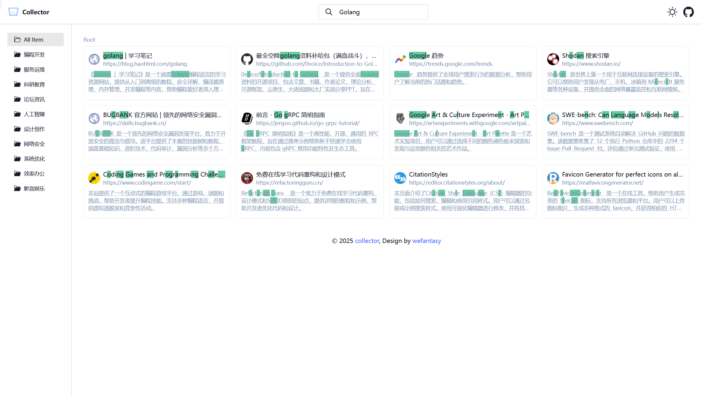
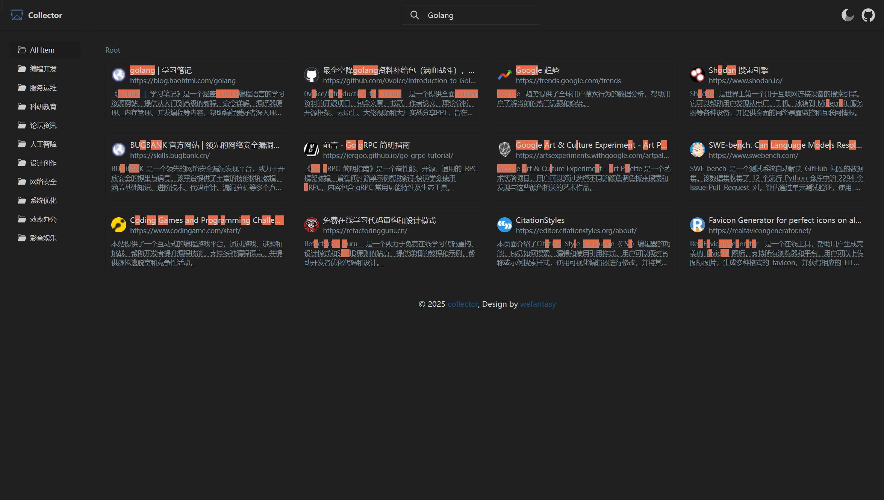

# Collector

[](LICENSE)

Collector 是一个简约个人导航站点，帮助您高效管理和分类喜爱的网站。

## 功能特性

- 📁 网站多级分类管理
- 🔍 标题、描述快速全文检索
- 🎨 主题切换
- 📱 响应式设计
- ⚙️ 自定义配置

## 示例




## 技术栈

- **前端框架**: [Svelte](https://svelte.dev) v5 + [SvelteKit](https://kit.svelte.dev) v2
- **构建工具**: [Vite](https://vitejs.dev) v6
- **UI库**: [DaisyUI](https://daisyui.com) v4 + [TailwindCSS](https://tailwindcss.com) v3
- **图标库**: [Iconify](https://iconify.design)
- **搜索**: [Fuse.js](https://fusejs.io)

## 使用方法

1. [点此 Fork](https://github.com/wefantasy/collector/fork) 这个项目到你的 GitHub 账户
2. 在你 Fork 的仓库下点击 `Actions` -> `I understand my workflows, go ahead and enable them` 启动流水线
3. 点击 `Actions` -> `Build and Deploy` -> `Run workflow`，选择 `main` 分支并运行流水线
4. 在 `Settings` -> `Pages` -> `Branch` 中选择 `gh-pages` 分支并 `Save`
5. 修改 `static/data.json` 文件并push到 `main` 分支

## 开发环境准备

1. 确认已安装 [Node.js](https://nodejs.org) (≥18.x)
2. 安装 pnpm:
```bash
npm install -g pnpm
```
3. 克隆项目:
```bash
git clone https://github.com/wefantasy/collector.git
```
4. 安装依赖:
```bash
pnpm install 
```
5. 启动开发服务器:
```bash
pnpm run dev
```

## 项目结构

```
collector/
├── src/               # 源代码
│   ├── lib/           # 共享工具和组件
│   ├── routes/        # 页面路由
│   └── app.css        # 全局样式
├── static/            # 静态资源
├── package.json       # 项目依赖
├── vite.config.js     # Vite 配置
└── tailwind.config.js # Tailwind 配置
```

## 构建与部署

生产环境构建：
```bash
pnpm run build
```

本地预览：
```bash
pnpm run dev
```

## 贡献指南

欢迎贡献代码、报告问题或提出改进建议！

1. `Fork` 这个仓库
2. 创建你的特性分支 (`git checkout -b feature/amazing-feature`)
3. 提交你的改动 (`git commit -m 'Add some amazing feature`)
4. 推送到分支 (`git push origin feature/amazing-feature`)
5. 提交 `Pull Request`


## 许可证

本项目采用 [MIT 许可证](LICENSE)。